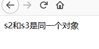
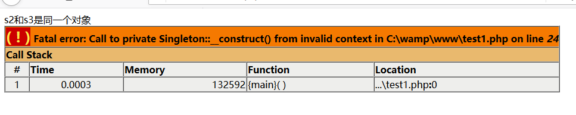
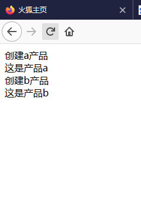
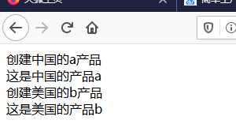
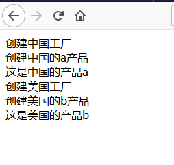
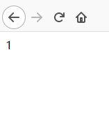
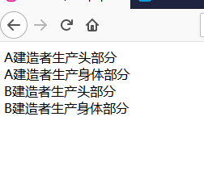
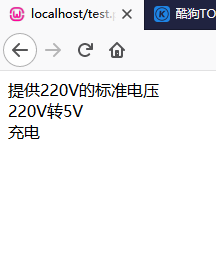

# 设计模式个人理解

<a href="#Six principles of design pattern">1.设计模式的六大原则</a>

<a href="#Singleton">2.单例模式</a>

<a href="#Simple factory mode">3.简单工厂模式</a>

4.工厂方法模式

5.抽象工厂模式

6.原型模式

7.建造者模式

8.适配器模式

9.桥接模式

10.装饰者模式

11.组合模式

12.外观模式

13.享元模式

14.代理模式

15.模板方法模式

16.命令模式

17.访问者模式

18.迭代器模式

19.观察者模式

20.中介者模式

21.职责链模式

22.策略模式

23.状态模式

24.解释器模式

25. 备忘录模式

    **为了更好的展示模式特性代码只保留最核心的部分**

## <a name="Six principles of design pattern">1.设计模式的六大原则</a>

- <a href="#Principle of single responsibility">单一职责原则</a>

- <a href="#Richter's principle of substitution">里氏替换原则</a>

- <a href="#Opening and closing principle">开闭原则</a>

- <a href="#Dimiter principle">迪米特原则</a>

- <a href="#Principle of Dependence Inversion">依赖倒置原则</a>

- <a href="#Interface isolation principle">接口隔离原则</a>

  ### <a name="Principle of single responsibility">单一职责原则</a>

  > **单一职责原则就是一个类只负责一个职责。**
  >
  > > <b>一类一职责：</b>写代码就像搭积木，一组积木实现一个功能。像用积木做一辆车，要用积木分别做轮子，车身，一组积木一个功能。要是车子推不动就改一下轮子，小人放不进车身就改一下车身，而不要每次出错都把整个车子都改了。

  ### <a name="Richter's principle of substitution">里氏替换原则</a>

  > **里氏替换原则就是尽量不要修改父类和重写父类的方法。**
  >
  > > <b>不要修改父类：</b>写代码就像搭积木，下层的积木不要动，一动上层也会倒。
  > >
  > > <b>不要重写父类方法：</b>写代码就像搭积木，下层如果是一个风格，上层也要风格一致，不然乱糟糟的。

  ### <a name="Opening and closing principle">开闭原则</a>

  > **开闭原则就是少删代码，多加代码。**
  >
  > > <b>少删代码，多加代码：</b>写代码就像搭积木，多加了把加的去掉就行了，拆积木要是发现不行常常忘记原来的格局。

  ### <a name="Dimiter principle">迪米特原则</a>

  > **迪米特原则就类与类的关系力求精简，类中的方法创对象要在类中事先声明。**
  >
  > > <b>类与类的关系力求精简：</b>一组积木与另一组积木除了必要的连接外不要额外的连接，不然会"城门失火，殃及池鱼"。
  > >
  > > <b>类中的方法创对象要在类中事先声明：</b>做一组大的积木要用到的小组积木，事先记录，大积木里的小积木出问题知道去哪里找那些小积木模型。

  ### <a name="Principle of Dependence Inversion">依赖倒置原则</a>

  >**依赖倒置原则就是不依赖实际的类而是依赖他集合的抽象。**
  >
  >> <b>不依赖实际的类而是依赖其抽象：</b>给大积木加小积木只要看底座合不合而不必指定固定的某组小积木。只要是那种底座类型的小积木都可加上。人依赖交通工具而不依赖汽车。

  ### <a name="Interface isolation principle">接口隔离原则</a>

  > **接口隔离原则就是接口下实现的类必须全部使用接口中的方法，也就是接口力求精简。**
  >
  > > <b>接口下的类必须全部使用接口中的方法：</b>就是预留四孔的大积木底座，可以插上底座为三孔的小积木，但不要这样做，丑。。。不稳定。。。浪费资源。。。


## <a name="Singleton">2.单例模式</a>


```php
<?php
class Singleton{
	static private $instance;
	static public function getinstance(){
		if(!self::$instance instanceof self) 
		{
			self::$instance=new self();
		}
		return self::$instance;
	}
}
$s0=new Singleton();
$s1=new Singleton();
if($s0===$s1)
{
	echo "s0和s1是同一个对象";
}
$s2=Singleton::getinstance();
$s3=Singleton::getinstance();
if($s2===$s3)
{
	echo "s2和s3是同一个对象";
}
else
{
	echo "s2和s3不是同一个对象";
}
?>
```



> 也可以用构造函数来禁止直接创建对象。
>
> ```php
> <?php
> class Singleton{
> 	private function __construct(){}
> 	private function __clone(){}
> 	static private $instance;
> 	static public function getinstance()
> 	{
> 		if(!self::$instance instanceof self) 
> 		{
> 			self::$instance=new self();
> 		}
> 		return self::$instance;
> 	}
> }
> $s2=Singleton::getinstance();
> $s3=Singleton::getinstance();
> if($s2===$s3)
> {
> 	echo "s2和s3是同一个对象";
> }
> else
> {
> 	echo "s2和s3不是同一个对象";
> }
> $s0=new Singleton();
> $s1=new Singleton();
> if($s0===$s1)
> {
> 	echo "s0和s1是同一个对象";
> }
> 
> ?>
> ```
>
> 

## <a name="Simple factory mode">3.简单工厂模式</a>

```php
<?php
class a
{
    static function show()
    {
        echo "这是产品a<br/>";
    }
}
class b
{
    static function show()
    {
        echo "这是产品b<br/>";
    }
}
class factory
{
    static function createProduct($p)
    {
        switch($p)
        {
            case 'a':
                $product=new a();
                echo "创建a产品<br/>";
                return $product;
                break;

            case 'b':
                $product=new b();
                echo "创建b产品<br/>";
                return $product;
                break;
        }

    }
}
$f=new factory(); //创建一个生产a的工厂
$pro1=$f->createProduct('a');//工厂生产a产品，创建了a对象
$pro1->show();//a产品展示
$pro2=$f->createProduct('b');//工厂生产b产品，创建了b对象
$pro2->show();//b产品展示
?>
```




## 4.工厂方法模式

> 感觉工厂方法模式就是多个简单工厂模式的组合，例子41--如有四个产品：中国a产品，中国b产品，美国a产品，美国b产品。
>
> **简单工厂实现的例子：**

> **工厂方法实现的例子：**
>
> ```php
> <?php
> class chinaA
> {
>     static function show()
>     {
>         echo "这是中国的产品a<br/>";
>     }
> }
> class chinaB
> {
>     static function show()
>     {
>         echo "这是中国的产品b<br/>";
>     }
> }
> class usaA
> {
>     static function show()
>     {
>         echo "这是美国的产品a<br/>";
>     }
> }
> class usaB
> {
>     static function show()
>     {
>         echo "这是美国的产品b<br/>";
>     }
> }
> class chinaFactory
> {
>     static function createProduct($p)
>     {
>         switch($p)
>         {
>             case 'A':
>                 $product=new chinaA();
>                 echo "创建中国的a产品<br/>";
>                 return $product;
>                 break;
> 
>             case 'B':
>                 $product=new chinaB();
>                 echo "创建中国的b产品<br/>";
>                 return $product;
>                 break;
> 
>         }
> 
>     }
> }
> class usaFactory
> {
>     static function createProduct($p)
>     {
>         switch($p)
>         {
>             case 'A':
>                 $product=new usaA();
>                 echo "创建美国的a产品<br/>";
>                 return $product;
>                 break;
> 
>             case 'B':
>                 $product=new usaB();
>                 echo "创建美国的b产品<br/>";
>                 return $product;
>                 break;
>         }
>     }
> }
> $cf=new chinaFactory(); //创建一个生产a的工厂
> $uf=new usaFactory();
> $pro1=$cf->createProduct('A');//工厂生产a产品，创建了a对象
> $pro1->show();//a产品展示
> $pro2=$uf->createProduct('B');//工厂生产b产品，创建了b对象
> $pro2->show();//b产品展示
> ?>
> ```
>
> 

> **对比发现工厂方法修改的原代码更少**原代码是炸药，越少动越好。

## 5.抽象工厂模式

感觉抽象工厂模式就是工厂方法加一个**工厂的工厂**

```php
<?php
class chinaA
{
    static function show()
    {
        echo "这是中国的产品a<br/>";
    }
}
class chinaB
{
    static function show()
    {
        echo "这是中国的产品b<br/>";
    }
}
class usaA
{
    static function show()
    {
        echo "这是美国的产品a<br/>";
    }
}
class usaB
{
    static function show()
    {
        echo "这是美国的产品b<br/>";
    }
}
class chinaFactory
{
    static function createProduct($p)
    {
        switch($p)
        {
            case 'A':
                $product=new chinaA();
                echo "创建中国的a产品<br/>";
                return $product;
                break;

            case 'B':
                $product=new chinaB();
                echo "创建中国的b产品<br/>";
                return $product;
                break;

        }

    }
}
class usaFactory
{
    static function createProduct($p)
    {
        switch($p)
        {
            case 'A':
                $product=new usaA();
                echo "创建美国的a产品<br/>";
                return $product;
                break;

            case 'B':
                $product=new usaB();
                echo "创建美国的b产品<br/>";
                return $product;
                break;
        }
    }
}

class factoryProducce
{
    static function createFactory($f)
    {
        switch($f)
        {
            case 'usa':
                $factory=new usaFactory();
                echo "创建美国工厂<br/>";
                return $factory;
                break;
            case 'china':
                $factory=new chinaFactory();
                echo "创建中国工厂<br/>";
                return $factory;
                break;
        }
    }
}
$fp=new factoryProducce();
$cf=$fp->createFactory('china');
$pro1=$cf->createProduct('A');//工厂生产a产品，创建了a对象
$pro1->show();//a产品展示
$uf=$fp->createFactory('usa');
$pro2=$uf->createProduct('B');//工厂生产b产品，创建了b对象
$pro2->show();//b产品展示
?>
```



## 6.原型模式

```php
<?php
class cloned
{
    public $no;
    public function copy()
    {
        return clone $this;
    }
}
$c=new cloned();
$c->no=1;
$c1=$c->copy();
$c->no=2;
echo $c1->no;
?>
```



可知copy方法产生的是一组与原来完全一样的对象，且与以前的对象无关。

## 7.建造者模式

```php
<?php
class product
{
    function productHead()
    {
        echo "生产头部分<br/>";
    }
    function productBody()
    {
        echo "生产身体部分<br/>";
    }
}
abstract class bulider
{
    public function bulidHead()
    {

    }
    public function bulidBody()
    {

    }
}
class buliderA extends bulider
{
    private $product;
    public function __construct()
    {
        $this->product=new product();
    }

    function bulidHead()
    {
        echo "A建造者";
        $this->product->productHead();
    }
    function bulidBody()
    {
        echo "A建造者";
        $this->product->productBody();
    }
}
class buliderB extends bulider
{
    private $product;
    public function __construct()
    {
        $this->product=new product();
    }

    function bulidHead()
    {
        echo "B建造者";
        $this->product->productHead();
    }
    function bulidBody()
    {
        echo "B建造者";
        $this->product->productBody();
    }
}
class director
{
    private $bulider;
    public function __construct(bulider $bulider)
    {
        $this->bulider=$bulider;
    }
    function bulidProduct()
    {
        $this->bulider->bulidHead();
        $this->bulider->bulidBody();
    }

}
$b=new buliderA();
$b1=new buliderB();
$d=new director($b);
$d->bulidProduct();
$d1=new director($b1);
$d1->bulidProduct();
?>
```



感觉建造者模式就是生产交给建造者，然后将需要的建造者传给设计者。

## 8.适配器模式

```php
<?php
class adaptee
{
    function proveV()
    {
        echo "提供220V的标准电压<br/>";
        return $v=220;
    }
}
class target
{
    function charge(vol5v $v)
    {
        if($v->output5V()==5)
        {
            echo "充电<br/>";
        }
        else
        {
            echo "电压不对劲<br/>";
        }
    }
}
interface vol5v
{
    function output5v();
}
class adapter implements  vol5v
{
    private $a;
    function __construct()
    {
        $this->a=new adaptee;
    }
    function output5V()
    {
        $v=$this->a->proveV();
        echo "220V转5V<br/>";
        return $v/44;
    }
}
$ar=new adapter();
$t=new target();
$t->charge($ar);
?>
```



感觉适配器模式就是适配器改变被适配者然后将符合条件的返回值传给用户。


## 9.桥接模式

## 10.装饰者模式

## 11.组合模式

## 12.外观模式

## 13.享元模式

## 14.代理模式

## 15.模板方法模式

## 16.命令模式

## 17.访问者模式

## 18.迭代器模式

## 19.观察者模式

## 20.中介者模式

## 21.职责链模式

## 22.策略模式

## 23.状态模式

## 24.解释器模式

## 25.备忘录模式