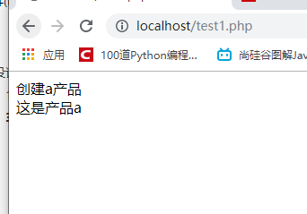

# 设计模式个人理解

<a href="#Six principles of design pattern">1.设计模式的六大原则</a>

2.单例模式

<a href="#Simple factory mode">3.简单工厂模式</a>

4.工厂方法模式

5.抽象工厂模式

6.原型模式

7.建造者模式

8.适配器模式

9.桥接模式

10.装饰者模式

11.组合模式

12.外观模式

13.享元模式

14.代理模式

15.模板方法模式

16.命令模式

17.访问者模式

18.迭代器模式

19.观察者模式

20.中介者模式

21.职责链模式

22.策略模式

23.状态模式

24.解释器模式

25. 备忘录模式

## <a name="Six principles of design pattern">1.设计模式的六大原则</a>

- <a href="#Principle of single responsibility">单一职责原则</a>

- <a href="#Richter's principle of substitution">里氏替换原则</a>

- <a href="#Opening and closing principle">开闭原则</a>

- <a href="#Dimiter principle">迪米特原则</a>

- <a href="#Principle of Dependence Inversion">依赖倒置原则</a>

- <a href="#Interface isolation principle">接口隔离原则</a>

  ### <a name="Principle of single responsibility">单一职责原则</a>

  > **单一职责原则就是一个类只负责一个职责。**
  >
  > > <b>一类一职责：</b>写代码就像搭积木，一组积木实现一个功能。像用积木做一辆车，要用积木分别做轮子，车身，一组积木一个功能。要是车子推不动就改一下轮子，小人放不进车身就改一下车身，而不要每次出错都把整个车子都改了。

  ### <a name="Richter's principle of substitution">里氏替换原则</a>

  > **里氏替换原则就是尽量不要修改父类和重写父类的方法。**
  >
  > > <b>不要修改父类：</b>写代码就像搭积木，下层的积木不要动，一动上层也会倒。
  > >
  > > <b>不要重写父类方法：</b>写代码就像搭积木，下层如果是一个风格，上层也要风格一致，不然乱糟糟的。

  ### <a name="Opening and closing principle">开闭原则</a>

  > **开闭原则就是少删代码，多加代码。**
  >
  > > <b>少删代码，多加代码：</b>写代码就像搭积木，多加了把加的去掉就行了，拆积木要是发现不行常常忘记原来的格局。

  ### <a name="Dimiter principle">迪米特原则</a>

  > **迪米特原则就类与类的关系力求精简，类中的方法创对象要在类中事先声明。**
  >
  > > <b>类与类的关系力求精简：</b>一组积木与另一组积木除了必要的连接外不要额外的连接，不然会"城门失火，殃及池鱼"。
  > >
  > > <b>类中的方法创对象要在类中事先声明：</b>做一组大的积木要用到的小组积木，事先记录，大积木里的小积木出问题知道去哪里找那些小积木模型。

  ### <a name="Principle of Dependence Inversion">依赖倒置原则</a>

  >**依赖倒置原则就是不依赖实际的类而是依赖他集合的抽象。**
  >
  >> <b>不依赖实际的类而是依赖其抽象：</b>给大积木加小积木只要看底座合不合而不必指定固定的某组小积木。只要是那种底座类型的小积木都可加上。人依赖交通工具而不依赖汽车。

  ### <a name="Interface isolation principle">接口隔离原则</a>

  > **接口隔离原则就是接口下实现的类必须全部使用接口中的方法，也就是接口力求精简。**
  >
  > > <b>接口下的类必须全部使用接口中的方法：</b>就是预留四孔的大积木底座，可以插上底座为三孔的小积木，但不要这样做，丑。。。不稳定。。。浪费资源。。。

  

## <a name="Simple factory mode">3.简单工厂模式</a>

```php
<?php
	class a
	{
		static function show()
        {
			echo "这是产品a";
		}
	}
	class factory
    {
		static function createA()
        {
			$a=new a();
			echo "创建a产品<br/>";
			return $a;
		}
	}
	$f_a=new factory(); //创建一个生产a的工厂
	$pro=$f_a->createA();//工厂生产a产品
	$pro->show();//a产品展示
?>
```


